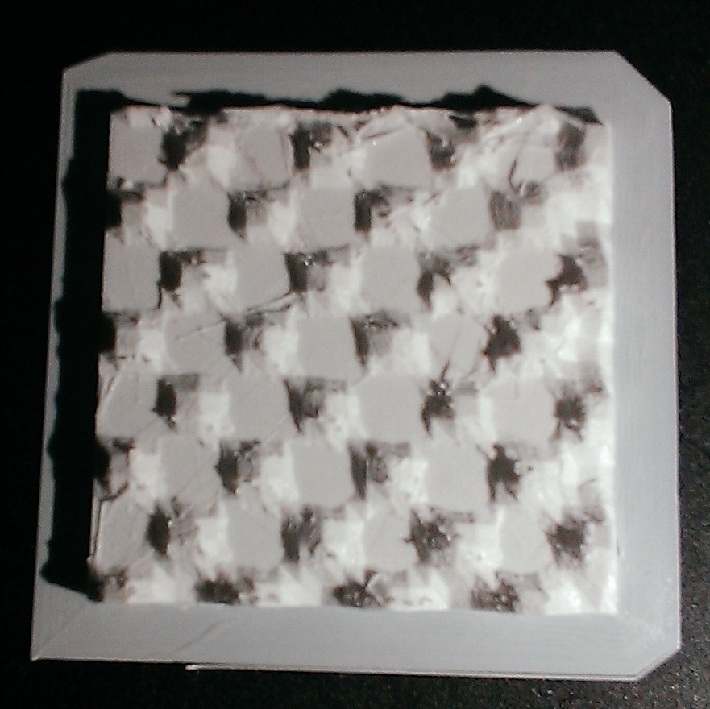
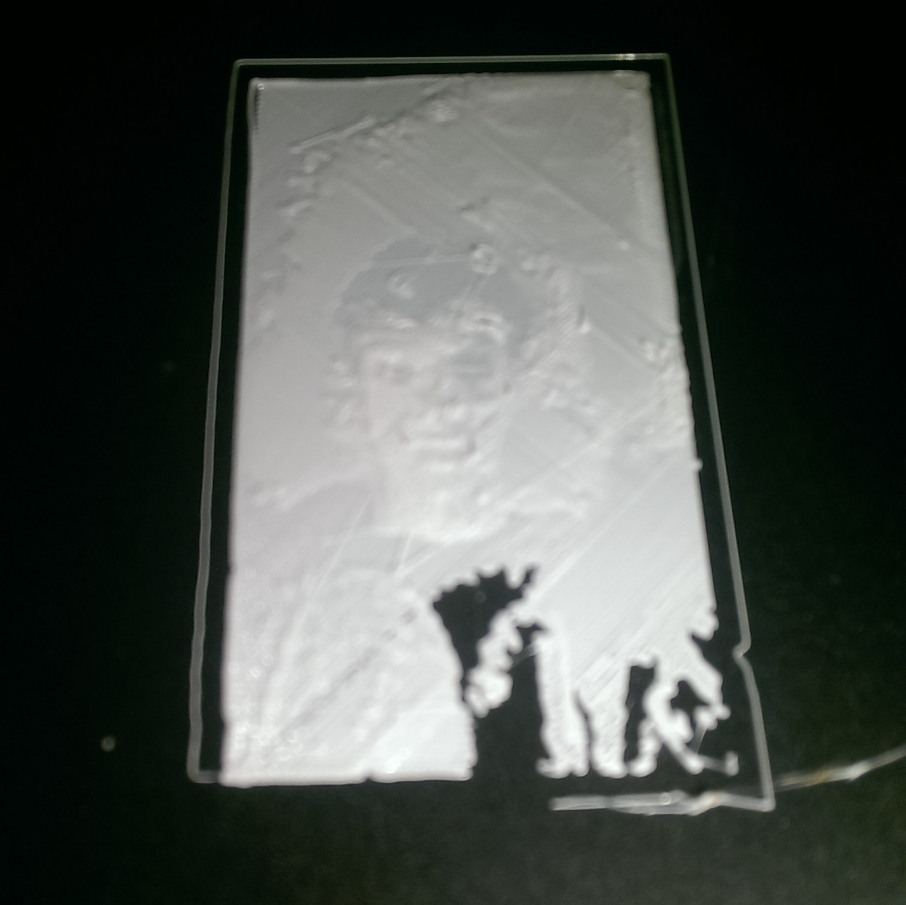
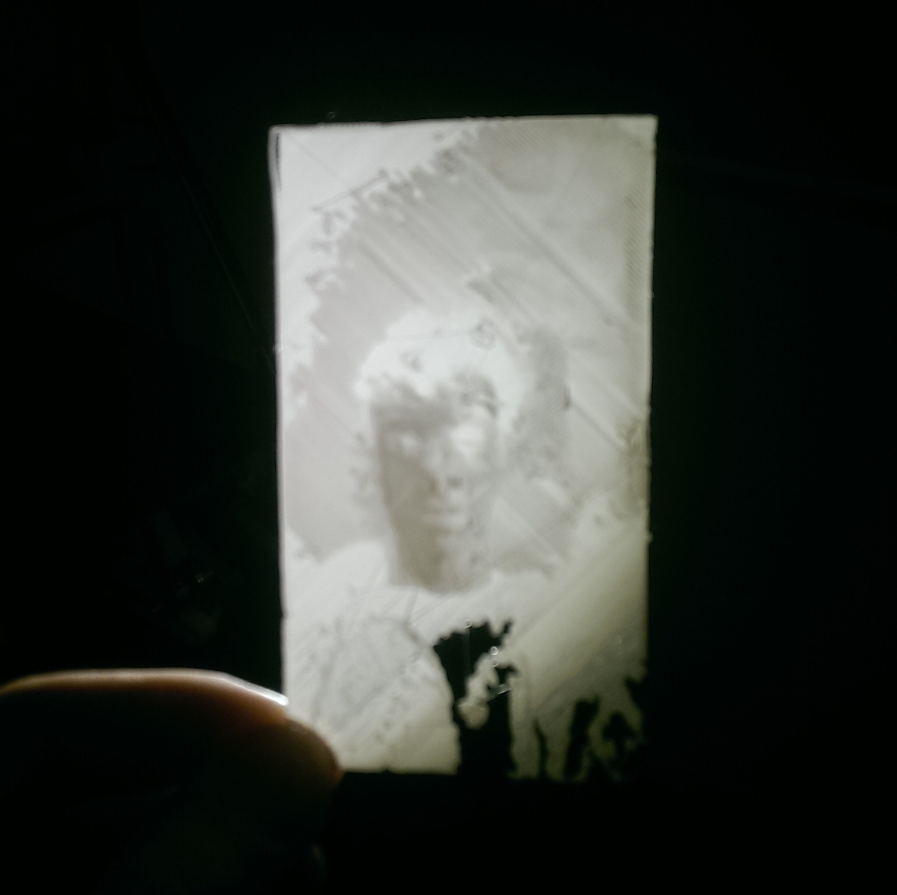
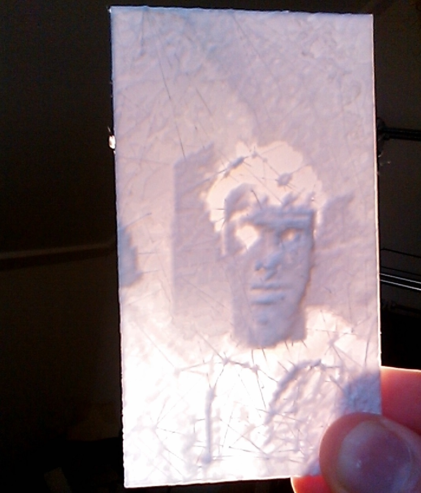

#PrinAPicture print's your picture (in 3D)
##This program will create a STL file from your picture!

**How to use:**
* Download the program and extract the it
* Put a JPG picture in the program folder `PrintAPicture-master/PrintAPicture` and name it `input.jpg`
* Run it in [Processing](http://processing.org)
* Decrease or increase the resolution with the left and right mouse buttons
* Save the STL file with the 's' key
* Print the thing.stl file!

The TestImage program makes the image that is the default `input.jpg`, it looks like this:

 

I've done some tests with a picture of me, so far these are the results:

 

The reason part of the image is missing is because I had to scale the model *way* down. Right now the program makes a huge model (I had to use an ASCII to binary converter to get it to load), so when you scale it down part of the model gets to thin to print. Of course you can fix this by scaling it up in the z-axis, so that's what I did for the second test.

 

This looks better I think, but with the backlight it would work better if the z-axis was inverted.
